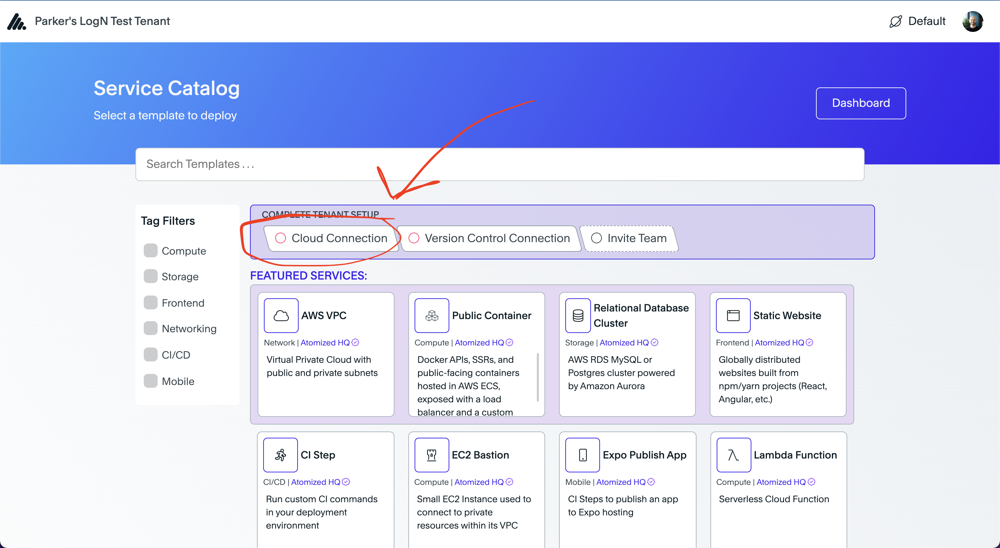
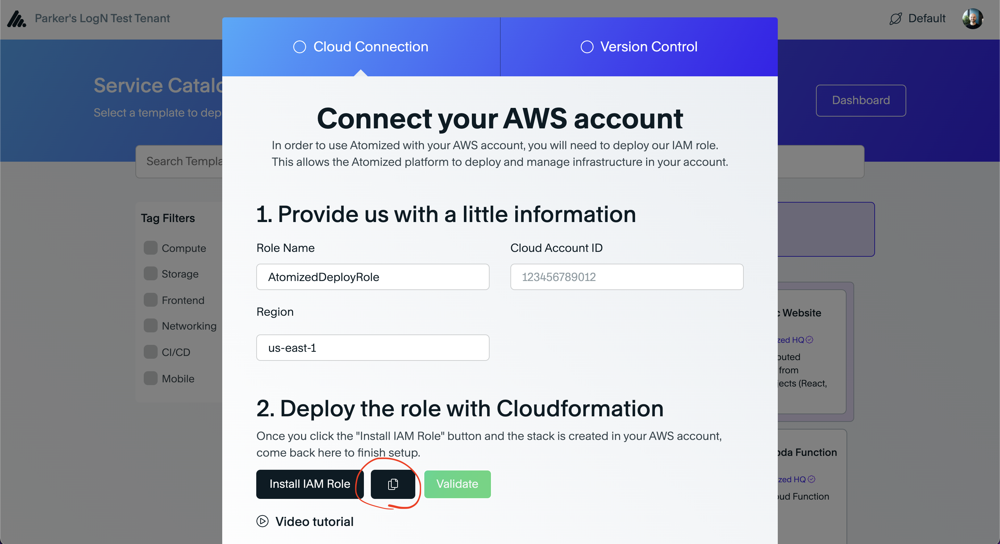
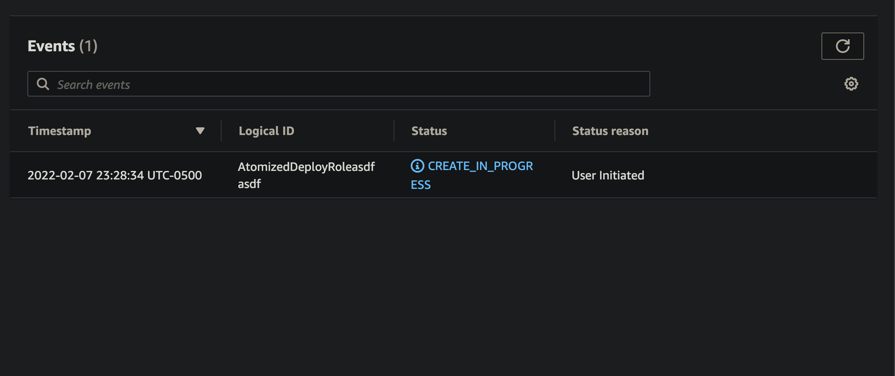
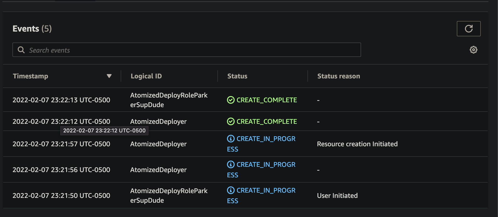
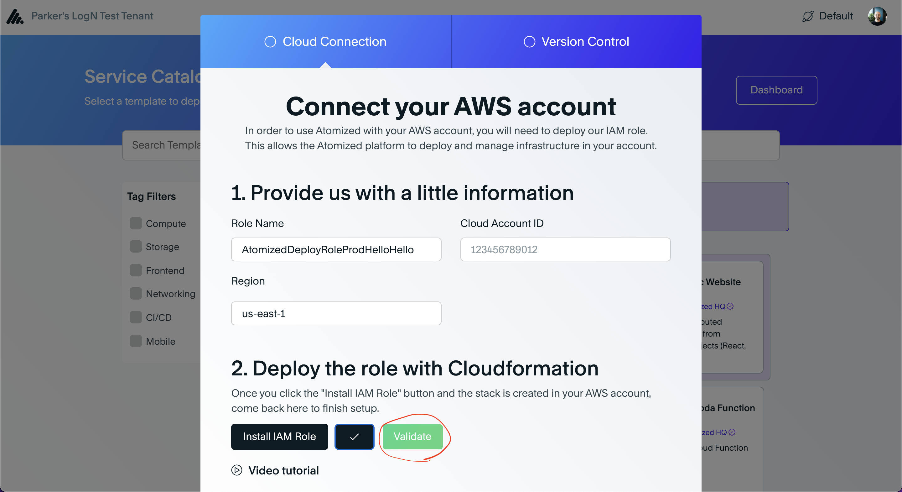
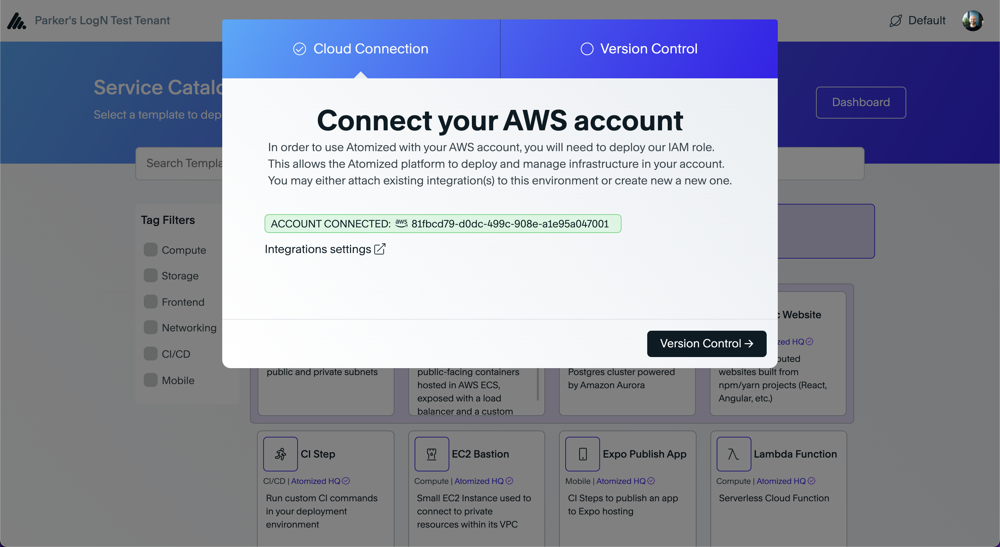
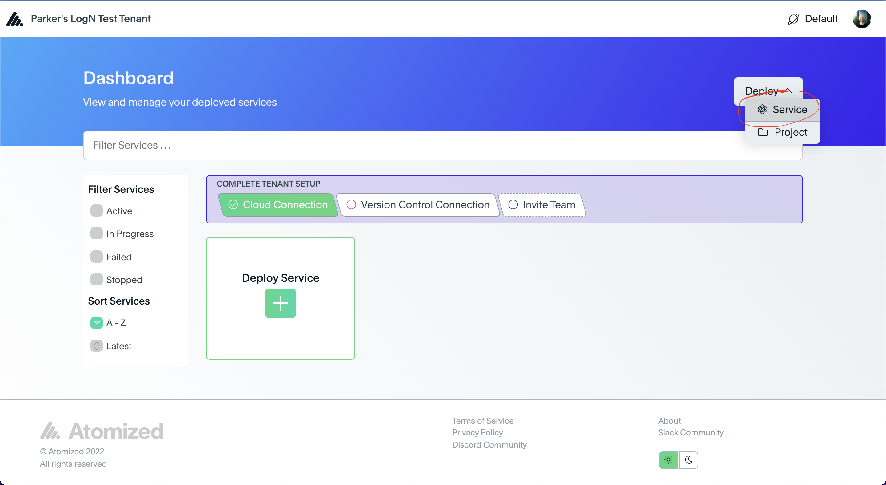
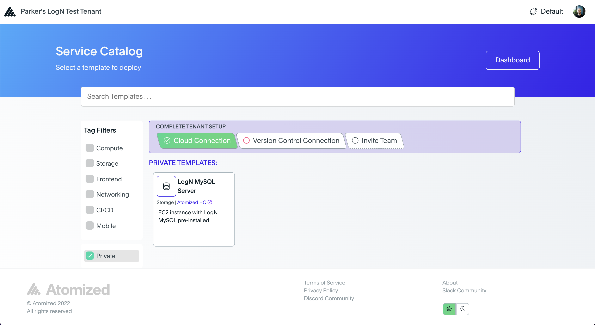
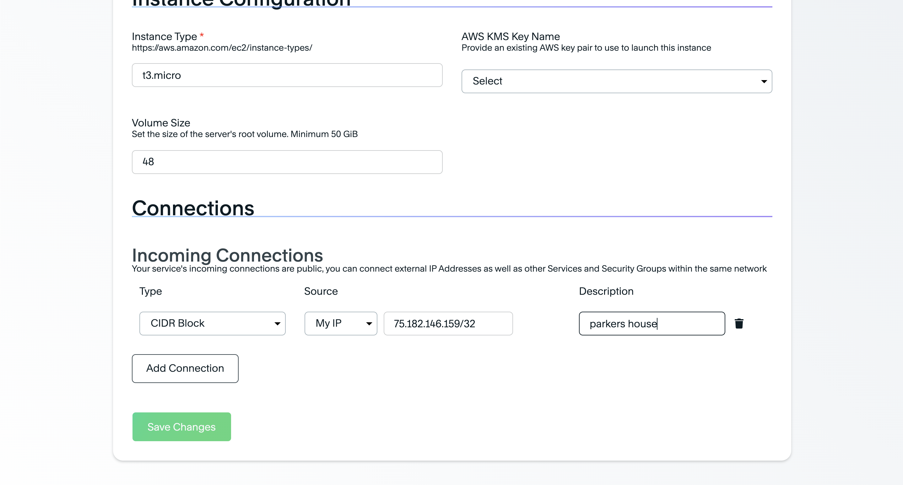
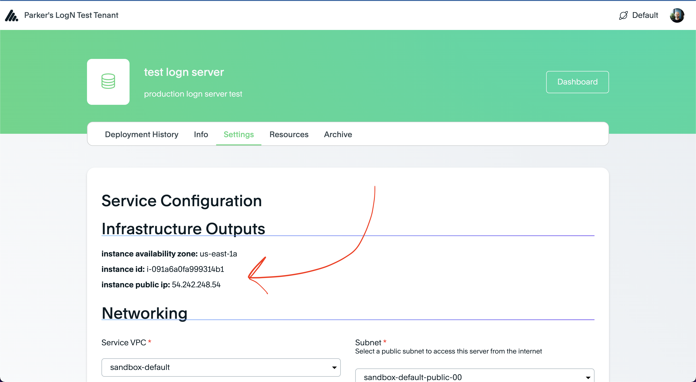

# deploy-template-lognovations-private

## How to Setup a new Tenant with LogN Services

1. Create a new tenant in Atomized
    - Navigate to https://app.atomizedhq.com/register
    - Leave your name the same
    - Add a new tenant name that identifies with the new customer
    - phone can be empty

Once registered, you will be redirected to the new tenant's dashboard. Stay here for the next step

2. (With Customer Assistance) Install Atomized IAM Role in customer AWS account
    - Request your customers install the Atomized IAM Role to allow Atomized to deploy the server into the customer's AWS account
    - From the new tenant's dashboard, click the 'Cloud Connection' tab in the 'Complete Tenant Setup' alert at the top
    
    - Change the role name and region if needed
    - Enter the customer's account id
    - Copy the cloud formation install URL using the copy button next to the 'Install IAM Role' button towards the bottom
    
    - DO NOT CLOSE THIS WINDOW UNTIL YOU'VE VALIDATED THE CONNECTION
    - Provide customer with link you just copied. DO NOT CLOSE YOUR WINDOW. 
    - Request the customer to log into the AWS console
    - Once logged into their AWS console, ask the customer to paste the install URL you copied into their browser, which will take them to cloudformation within the AWS console:
        1. Scroll to the bottom, click the check box to acknowledge the creation of the new role
        
        2. Click 'Create Stack'
        3. Wait about 20 seconds and refresh the 'Events' page until a 'CREATE_COMPLETE' event pops up for both the role and the AtomizedDeployer
        
        
    - Once the role creation is complete, click the 'Validate' button on your side in Atomized and make sure you see the green success message
    
    
    - The current tenant is now connected to the customer's AWS account

3. Request access to the private LogN listing
    - Currently the only way to allow tenants to access private listings is manual, so get in contact with Parker and request the new tenant you've created is allowed access to the private LogN Server listing

4. Deploy server
    - Once the tenant has access to the private listing, the Private filter will be available in the  service catalog
    - Access the service catalog from the dashboard, but clicking Deploy -> Service at the top right
    
    - From the service catalog, click the Private filter on the left side (only viewable once the tenant has access to a private listing)
    
    - Select the LogN MySQL server listing
    - Provide a name and basic description for the service
    - Ask the customer what VPC and subnet they would like to deploy the server in. If they don't have a VPC yet, one can be created using the [Atomized VPC Listing](https://app.atomizedhq.com/dashboard/tenant/environment/services/new/atomizedhq/deploy-template-aws-vpc)
    *NOTE* in order to access the server from the open internet you need to deploy the server into a public subnet, otherwise you can use a private subnet to restrict internet access to the server. A public subnet is required for this documentation
    - Enable Elastic IP if the customer needs the server to have a static, unchanging public IP address for the listing. Useful for public databases being accessed over the open internet.
    - Specify an instance type and volume size that meets the customer's needs
    - Optionally select an existing EC2 key pair to use as the key pair for the server. If the AWS account doesn't have a EC2 key pair to use, ask the customer to create a new key pair in their account. The key pair is used to ssh onto the server after it's running
    *NOTE* These docs use a method to ssh onto the server without having to attach a kms key pair, but it's still useful to have a key pair for every EC2 instance in your account
    - Add incoming connections to allow the customer's IP address and security groups to gain *DATABASE ACCESS* to the server
    
    - Add an IP to the 'Remote Access IP Address' field to allow the customer to gain *SSH ACCESS* to the server. This is required to initialize the server after deployment 
    - Continue to the summary page and then deploy the service
    - Allow the deployment ~20 minutes to apply the infrastructure and start the server

5. (With the customer) Start LogN MySQL within server
    - To kick off the server, you need to SSH onto the instance and manually run the initialization
    - Prerequisite: Go to the new service's settings page in atomized and take note of the infrastructure outputs at the top of the page, we'll need the public ip to connect to the server
    
    - Use the customer's EC2 Key Pair private key to ssh onto the server and start the database

```
# set variables from infrastructure outputs from prerequisite #1
PUBLIC_IP="3.89.70.28"

# set permissions on your EC2 key pair's private key
chmod 400 ~/Downloads/pballner-logn.pem

# connect to the server
ssh -i ~/Downloads/pballner-logn.pem ubuntu@$PUBLIC_IP
```

    - Once on the EC2 instance, run the following commands to initialize the server and configure the database

```
# initialize database
/logn_mysql/build/bin/mysqld --initialize

# copy the temporary root password provided in the output of the --initialize command

# start the database
/logn_mysql/build/bin/mysqld
```

    - Using a separate connection / client, connect to the database using the temporary password provided by the --initialize command to complete setup

```
sudo /logn_mysql/build/bin/mysql -p
```
