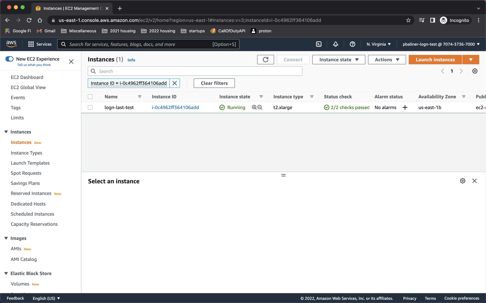

# Create LogN AMI

## How to create an Amazon Machine Image for the LogN MySQL Server

These are instructions to create an AMI using Ubuntu 20.04 and LogN MySQL. Other OS and server implementations would follow similar steps.

1. Launch a base Ubuntu 20.04 EC2 Instance
    - Navigate to AWS console
    - EC2 -> Instances -> Launch Instances Button (at the top right)
    - Scroll through the AMI listings and select `Ubuntu Server 20.04 LTS` (last appeared at number 8 in list)
    
    - Select an instance class. Something with at least 4 cores is recommended for server installation (t2.xlarge was selected for this example)
    
    - Click `Next: Configure Instance Details`
    - Select a Network and PUBLIC subnet. A public subnet is required to easily SSH onto the instance to perform the database initialization
    - Click `Next: Add Storage`
    - Select at least 50GB for storage size
    - Click `Next: Add Tags`
    - Optionally add tags to builder instance
    - It's recommended to add a `Name` tag. This will provide your instance with a name within the EC2 Dashboard
    - Click `Next: Configure Security Group`
    - Update the SSH rule to only include your current IP to protect the instance from access from the internet
    - Click `Review and Launch`
    - Click `Launch`
    - Select an EC2 Key Pair to launch with the instance. You will need the private key from the key pair to connect to the instance to perform server installation. You can create a new key pair if needed.
    - Click `Launch Instances`
    - Check the EC2 Dashboard and wait for the instance to initialize and for the status checks to complete before moving to next step
    

2. Log onto the instance and install LogN server
    - Using the EC2 Instance's public IP, the private key chosen when launching the instance, ssh onto the instance from the IP address specified in the instance's security group
    - You can find the EC2 Instance's public IP by selecting the instance in the EC2 Dashboard
```
PUBLIC_IP="3.89.70.28"

# set permissions on your EC2 key pair's private key
chmod 400 ~/Downloads/pballner-logn.pem

# connect to the server
ssh -i ~/Downloads/pballner-logn.pem ubuntu@$PUBLIC_IP
```
    - Once logged onto the instance, run the commands to install the LogN server

```
# [1] update packages
sudo apt-get update
sudo apt-get -y upgrade

# [2] install dependencies
sudo apt-get install -y libssl-dev libncurses-dev perl cmake make build-essential g++ bison pkg-config

# [3] create logn directory
sudo mkdir /logn_mysql
sudo chown -R ubuntu:ubuntu /logn_mysql
cd /logn_mysql

# [4] download source code
# use commit hash from latest commit to srh/dev
GITHUB_HASH="27c96bce50005762b4f11d4eb251b2c8349160e8"
git init
git remote add origin https://github.com/chrisamcelveen/logn_mysql.git
git fetch origin $GITHUB_HASH
# use a personal access token to authenticate against github
git reset --hard FETCH_HEAD
# optionally clean up the .git directory
# rm .git

# [5] Build binaries
mkdir build
cd build
sudo cmake ../ -DDOWNLOAD_BOOST=1 -DWITH_BOOST=/boost_1_73_0
sudo make -j4
```

The commands to initialize the database and start the database server will not be included in the AMI so consumers of the AMI can initialize and start the server on their own

3. Save instance as an AMI
    - Once all server data has been installed, return to the EC2 Dashboard in the AWS Console (EC2 -> Instances)
    - Select your instance, click `Actions` at the top, select `Images and Templates`, click `Create Image`
    
    - Enter a name and description for the image
    - You can propagate tags to the image to maintain the `Name` tag for easy identification of the AMI in the AMI dashboard
    - Click `Create Image` at the bottom

Go to the docs for [Launching Your AMI](./launch_ami.md) to learn how to launch the AMI we created in a customer's AWS Account