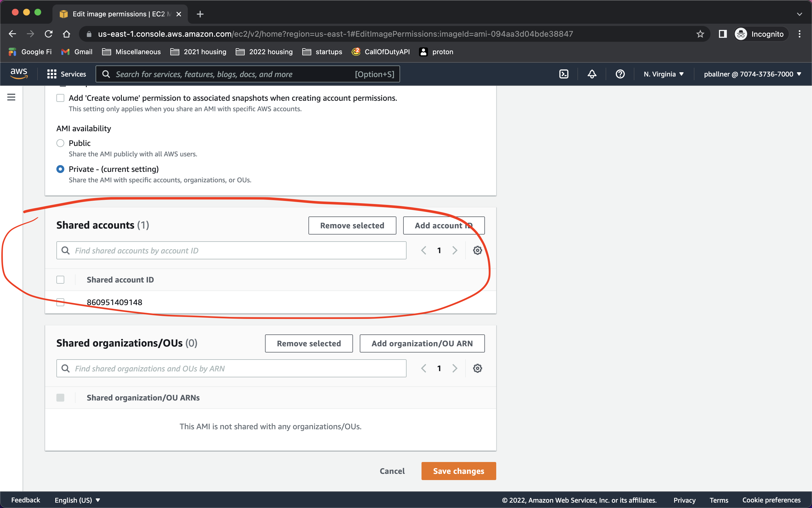
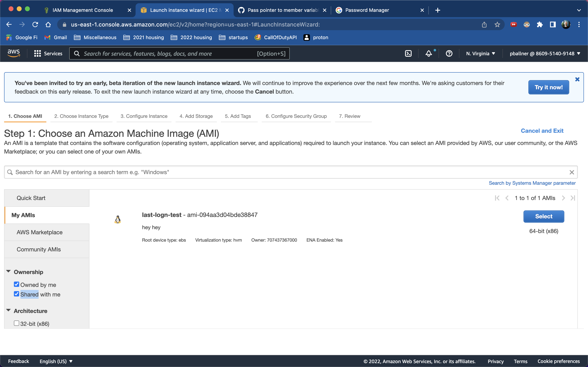
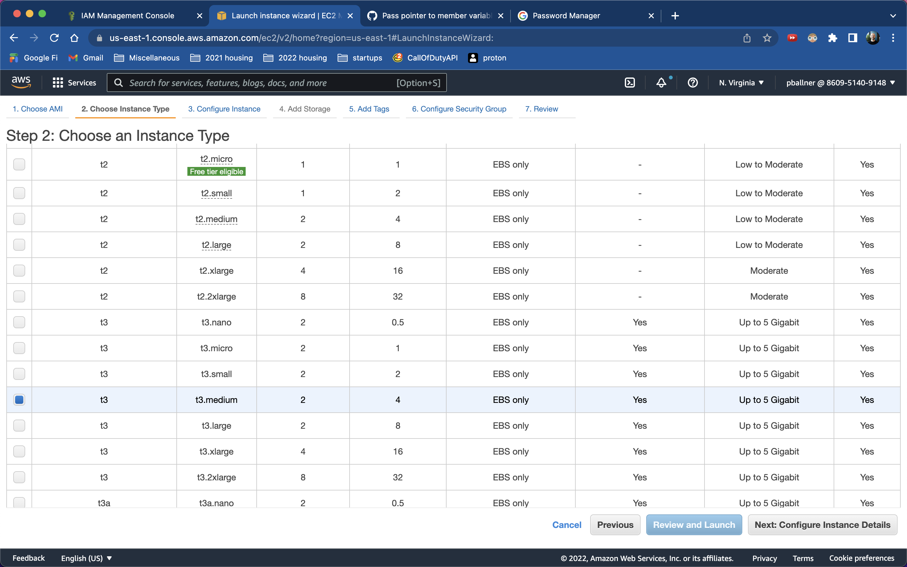
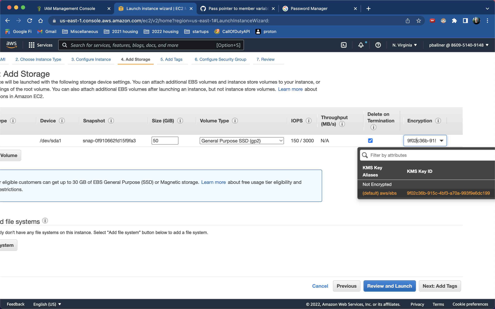
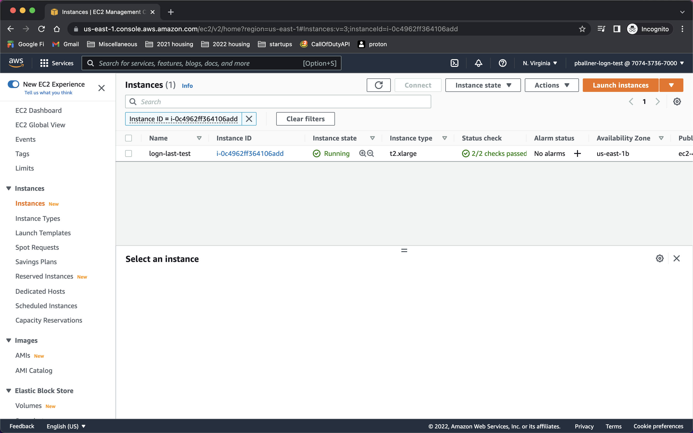

# Launch AMI

## How to use the custom LogN AMI to create a new LogN MySQL Instance

Now that we have a pre-built AMI for the LogN server, we can share this AMI with a customer's AWS Account and they can launch a LogN MySQL EC2 instance in their account

1. Allow customer account to access AMI
    - In the AWS Console, navigate to the AMI Dashboard (EC2 -> AMIs)
    - Select your AMI, click `Actions` and select `Edit AMI Permissions`
    - Scroll down to `Shared Accounts`, click `Add Account ID`, and enter the customer's AWS Account ID
    - Click `Save Changes` at the bottom
    - The customer's AWS Account will now be able to launch instances using your AMI
    

2. (From customer account) Launch the LogN AMI from the EC2 Dashboard
    - Navigate to AWS console
    - EC2 -> Instances -> Launch Instances Button (at the top right)
    - On the AMI listing page, select `My AMIs` on the left sidebar and check the box labeled `Shared with me` in the `Ownership` dropdown on the left sidebar. 
    - Select the AMI you shared with the customer
    
    - Select an instance class the best suits the customer's use case. (t3.medium was selected for this example)
    
    - Click `Next: Configure Instance Details`
    - Select a Network and PUBLIC subnet. A public subnet is required to easily SSH onto the instance to perform the server installation
    - Click `Next: Add Storage`
    - IMPORTANT: Ensure the volume already included in the settings has the same snapshot id as the custom AMI. This ensures everything pre-built within the AMI will be available to your instance
    - Select at least 50GB for storage size
    - Optionally choose a KMS to encrypt the storage for the database instance. You can use the default `aws/ebs` key or create your own
    
    - Click `Next: Add Tags`
    - Optionally add tags to builder instance
    - It's recommended to add a `Name` tag. This will provide your instance with a name within the EC2 Dashboard
    - Click `Next: Configure Security Group`
    - Update the SSH rule to only include your current IP to protect the instance from access from the internet
    - Add Inbound Security Group Rules for any IP addresses or security groups that should be able to access this database instance
    - Click `Review and Launch`
    - Click `Launch`
    - Select an EC2 Key Pair to launch with the instance. You will need the private key from the key pair to connect to the instance to perform server installation. You can create a new key pair if needed.
    - Click `Launch Instances`
    - Check the EC2 Dashboard and wait for the instance to initialize and for the status checks to complete before moving to next step
    

3. (Customer) Log onto the instance and initialize the database
    - To kick off the server, you need to SSH onto the instance and manually initialize the database
    - Use the instance's public IP and the customer's EC2 Key Pair private key to ssh onto the server
    - You can find the EC2 Instance's public IP by selecting the instance in the EC2 Dashboard

```
PUBLIC_IP="3.89.70.28"

# set permissions on your EC2 key pair's private key
chmod 400 ~/Downloads/pballner-logn.pem

# connect to the server
ssh -i ~/Downloads/pballner-logn.pem ubuntu@$PUBLIC_IP
```

4. Once on the EC2 instance, run the following commands to initialize the server and configure the database

```
# initialize database
/logn_mysql/build/bin/mysqld --initialize

# copy the temporary root password provided in the output of the --initialize command

# start the database
/logn_mysql/build/bin/mysqld
```

5. Using a separate connection / client, connect to the database using the temporary password provided by the --initialize command to complete setup

```
sudo /logn_mysql/build/bin/mysql -p

# once logged into mysql (using the temporary password from initialization), update root password
ALTER USER 'root'@'localhost' IDENTIFIED BY 'hellothere';

# test logn library
CREATE DATABASE d1;
USE d1;
CREATE TABLE t1 (id INT) COMPRESSION="logn";
```

